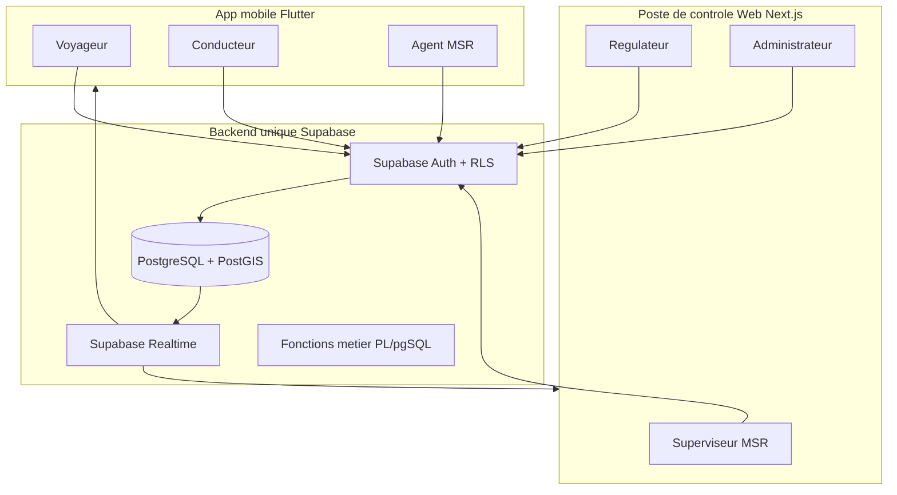
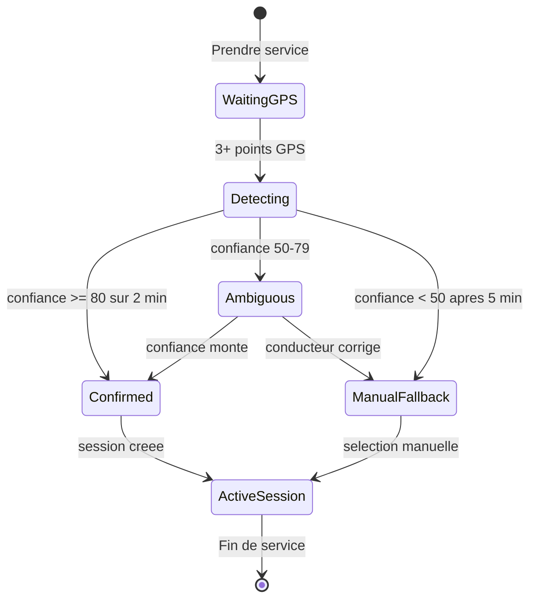
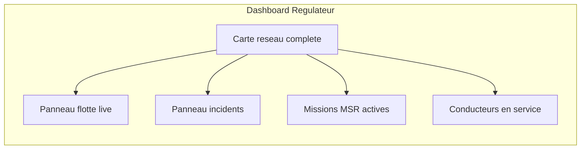
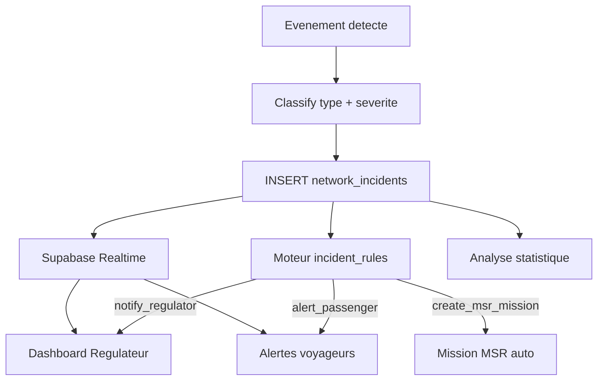

# Plateforme d'exploitation transport — Document d'architecture de référence

> **Statut** : validé — base officielle pour la mise en œuvre.
> **Version** : 1.0 · Juin 2026
> **Emplacement** : [`docs/ARCHITECTURE.md`](ARCHITECTURE.md)
>
> **Phase 0 backend** : migrations Supabase livrées dans [`supabase/migrations/`](../supabase/migrations/) (001–006).

## Contexte actuel

L’app Flutter existante est un **MVP usager passager** :
- Auth **100 % anonyme** via [`lib/services/supabase_service.dart`](lib/services/supabase_service.dart)
- Shell unique : [`lib/screens/app_shell.dart`](lib/screens/app_shell.dart)
- Géoloc passagère : [`lib/services/passive_tracking_service.dart`](lib/services/passive_tracking_service.dart)
- Détection probabiliste de ligne déjà en PostGIS : `detect_probable_route()` dans [`supabase/schema.sql`](supabase/schema.sql)
- Routage GTFS : [`lib/services/gtfs_service.dart`](lib/services/gtfs_service.dart)

**Décision actée** : évolution vers une **plateforme d’exploitation** avec séparation terrain / exploitation.

---

## Vision produit : deux surfaces, un backend



| Surface | Rôles | Usages |
|---------|-------|--------|
| **Mobile Flutter** | `passenger`, `driver`, `msr_agent` | Info-voyageur, prise de service conducteur, exécution patrouille MSR |
| **Web Next.js** | `msr_supervisor`, `regulator`, `admin` | Cartographie réseau, suivi temps réel, tableaux de bord, missions MSR, administration, statistiques |

**Stack Web** : Next.js · Supabase · PostGIS · Supabase Realtime · **MapLibre GL JS** (choix acté — open source, sans coût API)

---

## Rôles et permissions

| Rôle | Surface | Capacités principales |
|------|---------|----------------------|
| `passenger` | Mobile | Mode actuel (peut rester anonyme) |
| `driver` | Mobile | Prise de service auto-détectée, géoloc certifiée |
| `msr_agent` | Mobile | Réception missions, patrouille guidée |
| `msr_supervisor` | Web | Création / assignation missions MSR, zones |
| `regulator` | Web | Poste de contrôle : véhicules, conducteurs, agents MSR, incidents |
| `admin` | Web | Gestion utilisateurs, secteurs, dépôts, paramètres |

Schéma profils :

```sql
CREATE TABLE user_profiles (
  id UUID PRIMARY KEY REFERENCES auth.users(id) ON DELETE CASCADE,
  role TEXT NOT NULL CHECK (role IN (
    'passenger','driver','msr_agent',
    'msr_supervisor','regulator','admin'
  )),
  display_name TEXT,
  depot_id UUID REFERENCES depots(id),
  created_at TIMESTAMPTZ DEFAULT NOW()
);
```

---

## Priorités MVP (ordre de livraison)

1. **Géolocalisation temps réel des véhicules** — couche unifiée conducteur certifié + communautaire + GTFS-RT opérateur
2. **Mode Conducteur** — remontée position certifiée avec détection automatique ligne/sens/service
3. **Dashboard Web d’exploitation** — poste de contrôle régulateur
4. **Gestion missions MSR simplifiée** — secteurs prédéfinis, Web + mobile agent
5. **Planificateur intelligent** — buffer ligne GTFS + contrainte retour dépôt

Phases ultérieures : polygone libre MSR, automatisation incidents, statistiques avancées.

---

## 1. Fondations communes (Phase 0)

### 1.1 Structure monorepo

```
/Users/kevin/Waze/
├── lib/                    # App mobile Flutter (existant)
├── web/                    # NEW — Next.js poste de contrôle
│   ├── app/                # App Router
│   ├── components/         # Carte, tableaux de bord, missions
│   └── lib/                # Client Supabase, hooks Realtime
├── packages/               # NEW (optionnel) — types partagés
│   └── shared-types/       # Modèles TS/Dart alignés (missions, incidents)
└── supabase/
    ├── schema.sql
    └── migrations/
        ├── 001_auth_profiles_depots.sql
        ├── 002_driver_sessions.sql
        ├── 003_incidents.sql
        ├── 004_msr_missions.sql
        ├── 005_live_fleet_positions.sql
        └── 006_rls_policies.sql
```

### 1.2 Auth partagée

- **Mobile** : auth nominative pour `driver` / `msr_agent` ; anonyme conservé pour `passenger`
- **Web** : auth nominative obligatoire ; redirection selon rôle après login
- RLS basée sur `auth.uid()` + `user_profiles.role`
- JWT custom claims (optionnel) pour filtrage côté Realtime

### 1.3 Couche géoloc unifiée (socle MVP #1)

Vue matérialisée ou table `live_fleet_positions` alimentée par :

| Source | Confiance | Table source |
|--------|-----------|--------------|
| Conducteur certifié | 100 | `driver_location_events` |
| Communautaire agrégé | 40–90 | `community_vehicles` |
| Opérateur GTFS-RT | 95 | ingestion Okina/SIRI (existant côté mobile, à centraliser) |

Publication Supabase Realtime sur `live_fleet_positions` pour alimenter mobile et Web simultanément.

### 1.4 Indicateur de fiabilité véhicule (acté)

Chaque entrée de `live_fleet_positions` expose un **score de fiabilité composite** (0–100) permettant aux régulateurs d'évaluer la qualité de l'information en un coup d'œil.

**Trois composantes** :

| Composante | Poids | Calcul |
|------------|-------|--------|
| **Source** | 40 % | Conducteur certifié = 100 · Opérateur GTFS-RT = 95 · Communautaire = `confidence_score` (40–90) |
| **Fraîcheur** | 35 % | Décroissance linéaire : 100 si < 30 s, 50 à 2 min, 0 au-delà de 5 min |
| **Cohérence** | 25 % | Accord entre sources sur même `route_id` + proximité spatiale (< 200 m) ; bonus si conducteur et opérateur concordent |

```sql
CREATE TABLE live_fleet_positions (
  id UUID PRIMARY KEY DEFAULT gen_random_uuid(),
  route_id TEXT NOT NULL,
  trip_id TEXT,
  transport_type TEXT NOT NULL,
  geom GEOMETRY(Point, 4326) NOT NULL,
  speed NUMERIC,
  heading NUMERIC,
  source TEXT CHECK (source IN ('driver','community','operator')) NOT NULL,
  source_confidence INTEGER,          -- confiance brute de la source
  reliability_score INTEGER NOT NULL, -- score composite 0-100
  freshness_seconds INTEGER,
  coherence_score INTEGER,
  driver_session_id UUID,
  last_seen_at TIMESTAMPTZ DEFAULT NOW(),
  estimated_delay_seconds INTEGER
);
```

**Affichage régulateur (Web)** :
- Code couleur sur la carte : vert ≥ 80 · orange 50–79 · rouge < 50
- Filtre « masquer positions fiabilité < X »
- Tooltip détaillé : source · âge · cohérence inter-sources

**Fonction PostGIS** : `compute_reliability_score(source, source_confidence, last_seen_at, coherence_score)` — appelée à chaque mise à jour de position.

---

## 2. Mode Conducteur — détection automatique (MVP #2)

### 2.1 Principe : zéro saisie manuelle en conditions normales

Le conducteur :
1. Se connecte
2. Appuie sur **« Prendre mon service »**
3. L’app démarre le GPS et **identifie automatiquement** ligne, sens et service via `detect_probable_route()`
4. Affiche une **confirmation visuelle** (pas un formulaire) : « Tram 1 → Beaujoire — Confiance 87 % »
5. Corrige uniquement si l’auto-détection est incertaine (< seuil)



### 2.2 Algorithme de détection conducteur

Réutiliser et **étendre** `detect_probable_route()` existant ([`supabase/schema.sql`](supabase/schema.sql) L155–235) :

**Côté mobile** (`DriverAutoDetectService`) :
- Bufferiser les N derniers points GPS (vitesse, cap, précision)
- Appeler RPC `detect_probable_route` à chaque point
- **Stabiliser** le résultat : même `route_id` + `direction_id` sur ≥ 3 mesures consécutives à confiance ≥ 70
- Détecter le **service** (trip) via corrélation horaire : RPC `match_probable_trip(route_id, direction_id, lat, lon, timestamp)` — nouvelle fonction à créer, croisant position + `gtfs_stop_times`

**Côté serveur** — nouvelle RPC `start_driver_session_auto()` :
- Reçoit les derniers points GPS
- Retourne `{ route_id, direction_id, headsign, trip_id, confidence, status: 'confirmed'|'ambiguous'|'unknown' }`
- Crée `driver_sessions` si confiance suffisante

**Seuils proposés** :
- `confirmed` : confiance ≥ 80 stable 2 min + vitesse 2–25 m/s
- `ambiguous` : 50–79 → UI demande confirmation en un tap
- `unknown` : < 50 après 5 min → fallback sélection manuelle minimale (ligne + sens uniquement)

### 2.3 Modèle de données conducteur

```sql
CREATE TABLE driver_sessions (
  id UUID PRIMARY KEY DEFAULT gen_random_uuid(),
  driver_id UUID REFERENCES user_profiles(id) NOT NULL,
  route_id TEXT REFERENCES gtfs_routes(route_id),
  direction_id INTEGER,
  trip_id TEXT REFERENCES gtfs_trips(trip_id),
  headsign TEXT,
  detection_mode TEXT CHECK (detection_mode IN ('auto','manual','corrected')) DEFAULT 'auto',
  detection_confidence INTEGER,
  status TEXT CHECK (status IN ('detecting','active','paused','ended')) DEFAULT 'detecting',
  started_at TIMESTAMPTZ DEFAULT NOW(),
  confirmed_at TIMESTAMPTZ,
  ended_at TIMESTAMPTZ
);

CREATE TABLE driver_location_events (
  id BIGSERIAL PRIMARY KEY,
  session_id UUID REFERENCES driver_sessions(id) NOT NULL,
  geom GEOMETRY(Point, 4326) NOT NULL,
  speed NUMERIC, heading NUMERIC, accuracy NUMERIC,
  route_id TEXT,          -- détection instantanée
  confidence INTEGER,
  timestamp TIMESTAMPTZ DEFAULT NOW()
);
```

Alimentation directe de `live_fleet_positions` (pas d’agrégation communautaire pour les conducteurs).

### 2.4 UI mobile conducteur

Dossier [`lib/screens/driver/`](lib/screens/driver/) — **3 écrans max** :

| Écran | Contenu |
|-------|---------|
| `driver_home_screen.dart` | Bouton « Prendre mon service », état détection en cours |
| `driver_active_session_screen.dart` | Carte, ligne/sens détectés, confiance, pause/fin ; correction en un tap si ambigu |
| `driver_session_summary_screen.dart` | Récap service |

**Supprimé vs plan initial** : écran de sélection manuelle de service (devient fallback rare uniquement).

---

## 3. Poste de contrôle Web (MVP #3)

### 3.1 Application Next.js

Initialisation dans `web/` avec :
- **Next.js 14+** (App Router)
- **@supabase/ssr** pour auth côté serveur
- **MapLibre GL JS** pour cartographie réseau complète (tuiles OSM ou serveur interne)
- **Supabase Realtime** pour positions live, incidents, missions

### 3.2 Interface Régulateur (`regulator`)

Écran principal — **vue opérationnelle plein écran** :



| Module | Contenu |
|--------|---------|
| **Carte réseau** | Toutes lignes GTFS, véhicules live (3 sources), agents MSR, zones actives |
| **Flotte temps réel** | Liste filtrable par ligne, type, source, **fiabilité**, retard estimé |
| **Conducteurs** | Sessions actives, ligne détectée, dernière position, confiance |
| **Agents MSR** | Missions en cours, progression, position agent |
| **Incidents** | Flux temps réel, sévérité, statut, actions rapides |
| **Alertes** | Notifications Realtime (panne, surcharge, agression…) |

Pages Web :
- `/dashboard` — vue régulateur (défaut)
- `/missions` — gestion MSR (superviseur)
- `/incidents` — gestion incidents
- `/admin` — administration (admin)

### 3.3 Interface Superviseur MSR (Web uniquement)

Le superviseur **n’utilise pas le mobile**. Toute la planification se fait sur Web :
- Wizard création mission (secteur · buffer ligne · polygone)
- Assignation agent
- Review des propositions d’itinéraires (Phase 5)

---

## 4. Mode MSR (MVP #4 puis #5)

### 4.1 Répartition mobile / Web

| Fonction | Web (superviseur) | Mobile (agent) |
|----------|-------------------|----------------|
| Créer mission | Oui | Non |
| Définir zone | Oui (3 modes) | Non |
| Assigner agent | Oui | Non |
| Recevoir mission | Non | Oui (push/inbox) |
| Exécuter patrouille | Non | Oui |
| Clôturer mission | Vue Web | Oui (terrain) |

### 4.2 Trois mécanismes de zone (validés)

Priorité long terme : **buffer autour d'une ligne GTFS** (cas d'usage le plus puissant).

| Type | Usage | MVP |
|------|-------|-----|
| **Secteur prédéfini** | 80 % des missions courantes | MVP #4 |
| **Buffer ligne GTFS** | Missions liées à l'exploitation | MVP #5 |
| **Polygone libre** | Événements exceptionnels | Post-MVP |

Tables inchangées (voir plan précédent) : `msr_sectors`, `msr_missions`, `msr_patrol_proposals`.

### 4.3 MVP #4 — version simplifiée

- Seed secteurs : Commerce, Beaujoire, Centre-ville, Rezé, Atlantis, Pirmil
- Web : créer mission secteur + heure retour dépôt + assigner agent
- Mobile agent : inbox + carte zone + bouton démarrer/terminer
- **Sans planificateur intelligent** (itinéraire manuel ou affichage zone seule)

### 4.4 MVP #5 — planificateur intelligent

Service partagé (logique en RPC PostGIS + consommation Web/mobile) :

1. `msr_build_line_buffer(route_id, direction_id, distance_m)` → zone + arrêts
2. `msr_plan_patrol(mission_id)` → 2–4 propositions avec contrainte `depot_return_at`
3. Affichage Web superviseur + envoi proposition retenue à l'agent mobile

Heuristique buffer ligne (cas prioritaire) :
- Tronçon GTFS tronqué sur distance demandée
- Arrêts dans buffer → séquence de contrôle
- Retour dépôt via routage GTFS existant
- Validation `estimated_return_at <= depot_return_at`

---

## 5. Architecture incidents réseau (socle dès Phase 0)

Préparer dès maintenant un modèle extensible pour déclencher alertes, régulation et missions MSR.

### 5.1 Modèle de données

```sql
CREATE TYPE incident_severity AS ENUM ('info','warning','critical');
CREATE TYPE incident_status AS ENUM ('open','acknowledged','in_progress','resolved','closed');

CREATE TABLE network_incidents (
  id UUID PRIMARY KEY DEFAULT gen_random_uuid(),
  incident_type TEXT NOT NULL,  -- breakdown, accident, assault, deviation, overcrowding, control, works...
  severity incident_severity NOT NULL DEFAULT 'warning',
  status incident_status NOT NULL DEFAULT 'open',
  title TEXT NOT NULL,
  description TEXT,
  route_id TEXT REFERENCES gtfs_routes(route_id),
  geom GEOMETRY(Geometry, 4326),       -- point ou ligne ou polygone
  reported_by UUID REFERENCES user_profiles(id),
  source TEXT CHECK (source IN ('community','driver','regulator','operator','system')),
  related_session_id UUID,               -- driver_session ou msr_mission
  metadata JSONB DEFAULT '{}',
  created_at TIMESTAMPTZ DEFAULT NOW(),
  resolved_at TIMESTAMPTZ
);

-- Règles d'automatisation (Phase 6)
CREATE TABLE incident_rules (
  id UUID PRIMARY KEY DEFAULT gen_random_uuid(),
  incident_type TEXT NOT NULL,
  min_severity incident_severity,
  action_type TEXT CHECK (action_type IN ('alert','create_msr_mission','notify_regulator','adjust_service')),
  action_config JSONB NOT NULL,
  enabled BOOLEAN DEFAULT TRUE
);

CREATE TABLE incident_actions_log (
  id UUID PRIMARY KEY DEFAULT gen_random_uuid(),
  incident_id UUID REFERENCES network_incidents(id),
  rule_id UUID REFERENCES incident_rules(id),
  action_type TEXT,
  result JSONB,
  executed_at TIMESTAMPTZ DEFAULT NOW()
);
```

### 5.2 Lien avec l'existant

- Migrer progressivement [`reports`](lib/models/report.dart) communautaires vers `network_incidents` (ou vue de compatibilité)
- Types déjà présents : `delay`, `crowded`, `breakdown`, `accident`, `control`, `safety`, `works`
- Signalements conducteur certifié → `source = 'driver'`, confiance élevée

### 5.3 Automatisations cibles (vision long terme)

Les incidents deviennent le **hub central** de plusieurs boucles automatiques :

| Automatisation | Surface impactée | Phase |
|----------------|------------------|-------|
| **Alertes voyageurs** | Mobile passager (push, bannière accueil, carte) | Phase 6 |
| **Notifications régulateurs** | Web dashboard (Realtime + toast) | Phase 3 (manuel) → Phase 6 (auto) |
| **Création missions MSR auto** | Web superviseur + mobile agent | Phase 6 |
| **Analyse statistique perturbations** | Web admin / reporting | Phase 6+ |



Exemples de règles futures :
- `assault` + `critical` → alerte régulateur + mission MSR secteur auto + push voyageurs zone
- `overcrowding` sur ligne X → suggestion buffer ligne pour contrôle
- `breakdown` signalé par conducteur → incident certifié + impact flotte sur carte
- `deviation` opérateur → notification régulateur + recalcul fiabilité flotte

Table complémentaire pour l'analyse (Phase 6+) :

```sql
CREATE TABLE incident_statistics_daily (
  date DATE NOT NULL,
  incident_type TEXT NOT NULL,
  route_id TEXT,
  count INTEGER DEFAULT 0,
  avg_resolution_minutes NUMERIC,
  PRIMARY KEY (date, incident_type, route_id)
);
```

---

## 6. Organisation du code cible

### Mobile Flutter (`lib/`)

```
lib/
├── models/
│   ├── driver_session.dart
│   ├── msr_mission.dart
│   └── network_incident.dart
├── services/
│   ├── auth_service.dart
│   ├── driver_auto_detect_service.dart    # NEW — détection auto
│   ├── active_driver_tracking_service.dart
│   ├── msr_agent_service.dart             # inbox + patrouille
│   └── live_fleet_service.dart            # Realtime positions
└── screens/
    ├── mode_gate.dart
    ├── auth/
    ├── driver/                            # 3 écrans
    └── msr/agent/                         # inbox + patrouille
```

**Retiré du mobile** : écrans superviseur MSR (déplacés vers Web).

### Web Next.js (`web/`)

```
web/
├── app/
│   ├── (auth)/login/
│   ├── (dashboard)/dashboard/           # Régulateur
│   ├── (dashboard)/missions/            # Superviseur MSR
│   ├── (dashboard)/incidents/
│   └── (admin)/admin/
├── components/
│   ├── map/                             # MapLibre, layers GTFS, flotte
│   ├── fleet/                           # Panneaux véhicules, conducteurs
│   ├── msr/                             # Wizard missions, planificateur
│   └── incidents/                       # Flux, détail, actions
└── lib/
    ├── supabase/                        # Client SSR + Realtime hooks
    └── api/                             # Appels RPC PostGIS
```

---

## 7. Plan de livraison révisé

| Phase | MVP | Contenu | Durée estimée |
|-------|-----|---------|---------------|
| **0** | — | Migrations Supabase (auth, conducteur, incidents, MSR, flotte, RLS) — **backend livré** | 1–2 sem. |
| **1** | #1 | `live_fleet_positions`, ingestion 3 sources, Realtime mobile + Web stub | 1–2 sem. |
| **2** | #2 | Conducteur auto-detect, `DriverAutoDetectService`, session certifiée | 2 sem. |
| **3** | #3 | Next.js dashboard régulateur (carte + flotte + incidents + conducteurs) | 2–3 sem. |
| **4** | #4 | MSR simplifié : secteurs, Web création, mobile agent | 1–2 sem. |
| **5** | #5 | Buffer ligne GTFS + planificateur retour dépôt | 2–3 sem. |
| **6** | — | Polygone libre, moteur `incident_rules`, automatisation | 2+ sem. |

---

## 8. Points de vigilance

| Sujet | Recommandation |
|-------|----------------|
| **Détection auto conducteur** | Tester sur lignes à branches (Tram 1 Beaujoire/Babinière) ; prévoir correction rapide |
| **Données dépôts** | Seed interne [`supabase/seed_depots.sql`](supabase/seed_depots.sql) — coordonnées à fournir |
| **Cartographie Web** | **MapLibre GL JS** acté ; tuiles OSM ou serveur tuiles interne |
| **RGPD** | Traitements distincts passager (15 min) vs conducteur/MSR (durée service) |
| **Types partagés** | Aligner modèles Dart/TS pour missions et incidents (éviter dérive) |
| **Mode offline** | Conducteur/MSR/Web exploitation requièrent Supabase live |

---

## 9. Décisions actées (validation finale)

- Architecture **deux surfaces** : mobile terrain + Web exploitation
- Rôles : voyageur, conducteur, agent MSR (mobile) · superviseur, régulateur, admin (Web)
- Backend unique Supabase/PostGIS avec RLS
- Stack Web : **Next.js + Supabase + PostGIS + Realtime + MapLibre**
- Couche temps réel unifiée (`live_fleet_positions`) : conducteur + communautaire + opérateur
- **Score de fiabilité** par véhicule (source · fraîcheur · cohérence)
- Conducteur : **détection automatique** — connexion → démarrage → détection → confirmation si ambiguïté
- MSR : 3 modes de zone ; **buffer ligne GTFS** = mécanisme principal à moyen terme
- **Socle incidents** dès Phase 0 ; automatisations (alertes voyageurs, régulateurs, MSR auto, stats) en Phase 6+
- MVP ordonné : géoloc → conducteur → dashboard Web → MSR simple → planificateur
- Document validé comme **architecture de référence** du projet

## 10. Point ouvert restant

**Coordonnées exactes des dépôts Naolib** — nécessaire pour le planificateur MSR (Phase 5). Peut être collecté en parallèle des Phases 0–4.

## 11. Démarrage mise en œuvre

Phases prêtes à démarrer dans l'ordre :
1. **Phase 0** — monorepo, migrations Supabase, auth, socle incidents, `live_fleet_positions` + score fiabilité
2. **Phase 1** — ingestion temps réel 3 sources
3. **Phase 2** — mode Conducteur auto-détecté
4. **Phase 3** — dashboard Web MapLibre
5. **Phase 4** — MSR simplifié
6. **Phase 5** — planificateur buffer ligne
7. **Phase 6** — automatisation incidents + statistiques
